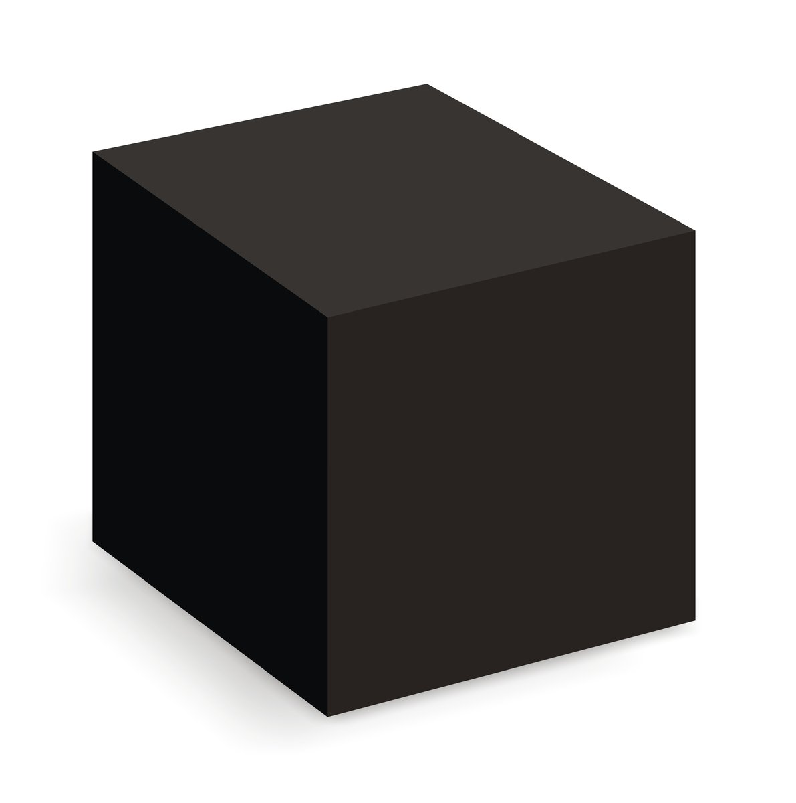

<div align="center">
<h1>The UYB Compiler Backend</h1>

<b>UYB is a from-scratch optimising compiler backend written in C, designed to be small and have fast compilation, while still being complete enough to be used for an actual compiler.</b>


</div>

UYB is based heavily on QBE IR syntax and is almost fully instruction set compatible. The goal is self hosting through [cproc](https://github.com/michaelforney/cproc), which is a C compiler which targets QBE's IR.

There's a Discord server for UYB which you can join for help setting up your language with UYB, helping to contribute, or just having a chat, which you can join [here](https://discord.gg/W5uYqPAJg5).


## Why not just the original QBE?
I myself absolutely love QBE, and am a huge fan of the "80% of the performance in 10% of the code," however there are a few things that UYB improves upon (or may also just be a different use case rather than being better):
 - **QBE doesn't support inline assembly.** In most cases, this is fine, but when working on a very low level language where you simply need to interact with the CPU's instructions directly, a lack of inline assembly support can be unfortunate, and it's a massive Quality of Life feature to not need to put every single piece of assembly in a seperate file.
 - **There's still room for QBE to be smaller.** UYB accepts slower runtime speeds of generated assembly, and uses less optimisations in return for a smaller amount of code and faster compilation - the goal with UYB is more like 60% of the speed in 5% of the code.
 - **Debug symbols support.** Unfortunately, QBE doesn't support debug symbols, which means debugging generated programs with GDB is near impossible to do effectively.

## Support
UYB supports every QBE instruction except for floating point instructions and variadic argument instructions. UYB also supports:

### Optimisations
 - Folding
 - Copy elimination
 - Unused label removal

### Targets
 - x86_64 generic System-V
 - SSA IR

## Usage
Since UYB is supposed to be based on QBE's IR, you can see [QBE's documentation](https://c9x.me/compile/doc/il.html) for a full IR reference.

There are more examples for UYB programs in `/examples`, or try run this small "Hello World" program to test UYB like so:
- Copy this code into a file named `test.ssa` or something similar:
    ```
    data $msg = {b "Hello, world!", b 10, b 0}
    export function w $main(l %argc, l %argv) {
    @start
        call $printf(l $msg)
        ret 0
    }
    ```
- Compile the IR to x86_64 Assembly using the following command:
    ```sh
    $ uyb test.ssa -o out.S
    ```
- Use a standard toolchain to assemble and link the generated Assembly to an executable program, then run it:
    ```sh
    $ gcc out.S -o out
    $ ./out
    Hello, world!
    ```

You can use `uyb --help` to see all the command line options for UYB.

## Building
To clone and build UYB, simply run:
```sh
git clone https://github.com/UnmappedStack/UYB
mkdir UYB/build
make
```
This will also install a symlink in your bin directory so that you can call UYB from anywhere. CMake is required.

## License
This project is under the Mozilla Public License 2.0. See `LICENSE` for more information.
